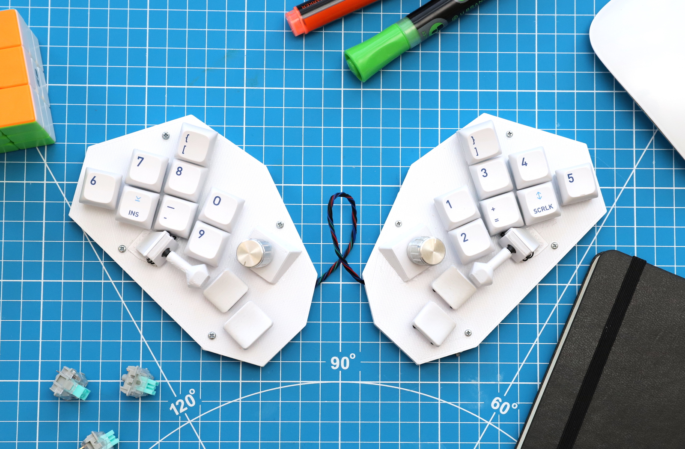
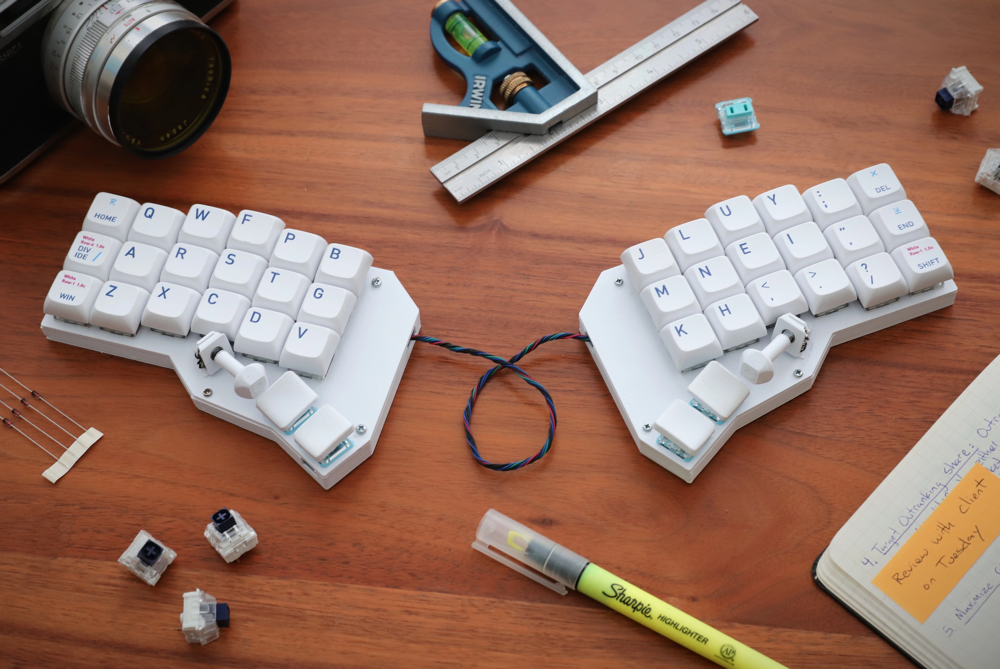
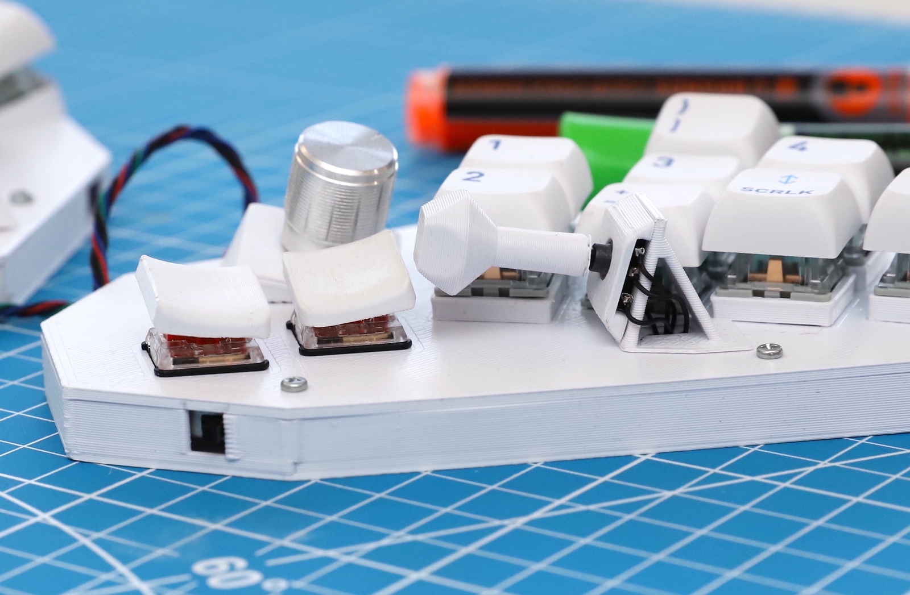
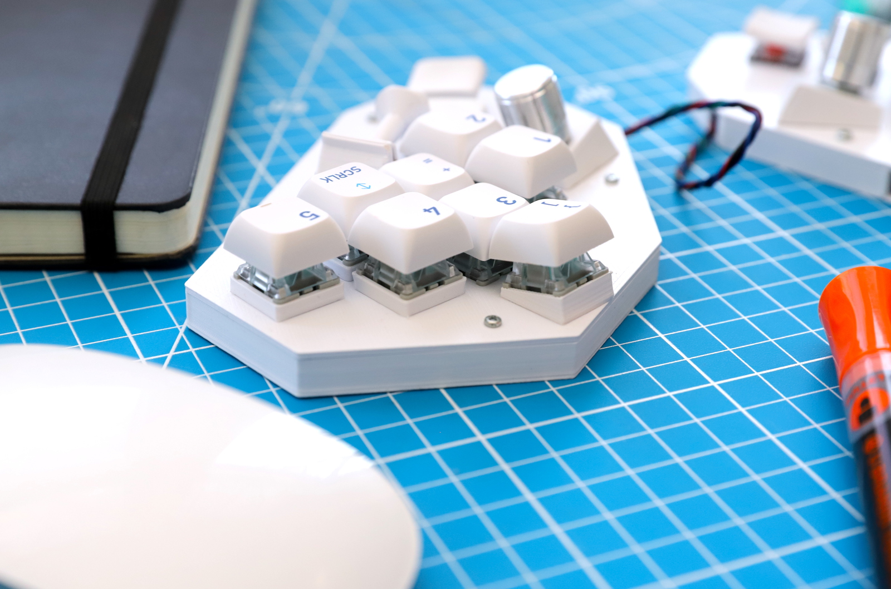
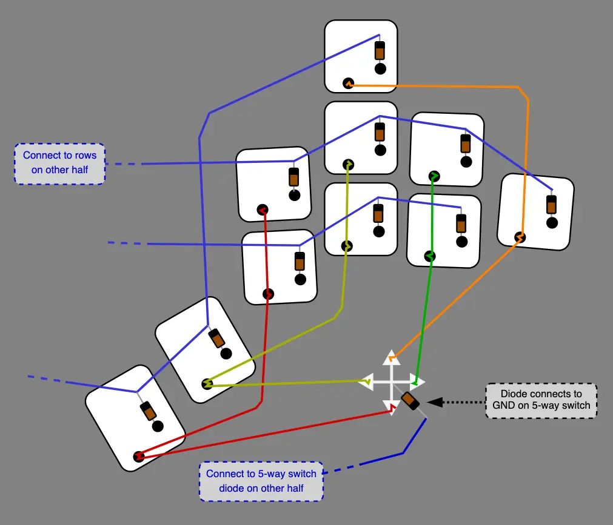
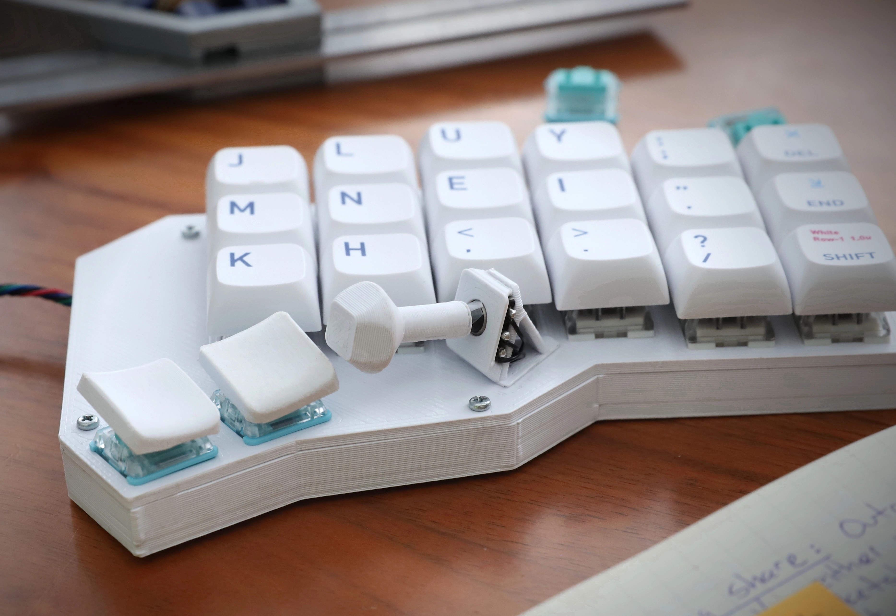
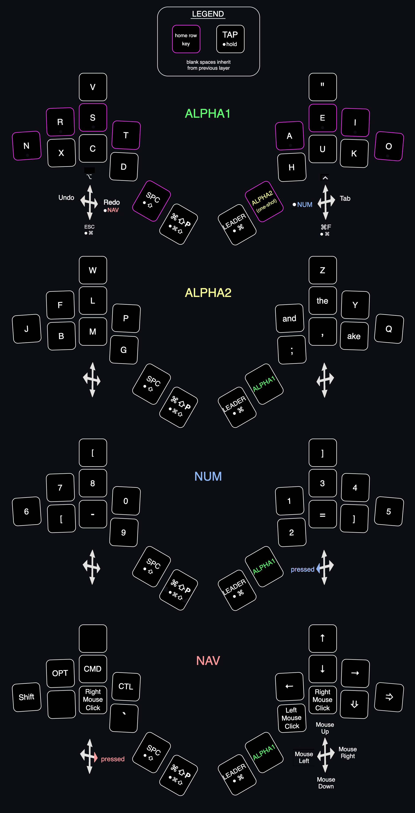

## <h2 align="center"> Leverage the power of opposable thumbs</h2>

<!-- # Fulcrum Keyboard -->

The Fulcrum is a wireless ergonomic keyboard that features 5-way switch joysticks, which are mounted horizontally to take advantage your thumb's natural range of motion.

It runs KMK circuitpython firmware on an nRF52840 microcontroller.

There are currently two versions of the Fulcrum: the **20-key version** pictured here, and a **40-key version** pictured below. (These key counts do not include the 5-way switches.)

*(NOTE: there is now a 34-key "beta" version as well)*

# Keyboard Features

## 👍 5-Way Switch Thumb Joysticks

Our thumbs are criminally underutilized on regular keyboards. Your two most capable fingers, both relegated to just one key - the space bar.

Many ergonomic keyboards try to rectify this problem by giving each thumb several keys. This is an improvement, but most people quickly find that it is actually quite difficult for your thumb to stretch over multiple keys and hit something accurately, let alone comfortably. More inefficency!

So what's going on with our phones? Look at how well we use our thumbs to type there. On a smartphone, our thumbs are fast, accurate, and dexterous. Incredibly efficient. What's the disconnect? Why are they so nimble over there, and so lumbering and inaccurate on our keyboards?

> The disconnect is that our thumbs are *opposable*, but for some reason our keyboards keep insisting on giving them the same type of key as our other fingers. Our thumbs want to move in a different direction!

> The 5-way switch joysticks on the Fulcrum are mounted sideways, allowing you to use your thumbs in a dimension that is more similar to how they move when you type on a smartphone. This immediately feels comfortable and natural, because it is how you already use your thumbs most other parts of your daily life.

With the regular key switch placed below joystick, this actually puts six different actions at the tip of each thumb with very minimal movement.

Most importantly, all of these actions are easily paired with other key presses elsewhere on the keyboard.

> **Note**
> Useful tips to help you choose what functions to assign to the joysticks:
> 1. Pressing "down" (towards the desk) on the joystick should be a layer switch when held. This is because it is the easiest motion to hold & press other keys.
> 2. Mod-Tap works well on them, so consider a "hold" & "tap" key for each
> 3.  The first few times you use them, you may find it hard to not move the whole board around a bit when pressing certain directions. This will go away after a day or two of getting used to the movements.

##   Combos
A combo is when you press two or more keys at the same time to output a different key.

The 20-key version of this keyboard uses a significant number of combos. You don't have to keep them all, but some are important.

Here is a guide to most of the important combos. They are generally split into combos that output words, and combos that output keys or actions (like "delete").

> **Note**
> If you want to add more combos, you will need to delete some that are already defined, as the firmware is basically operating at its limit right now.

##  Word Keys

Combos are great, but sometimes it's also nice to just press one key and output multiple.

We type the words "<ins>the</ins>" and "<ins>and</ins>" a lot. Even more-so if you include when they appear as a part of another word (<ins>the</ins>m, <ins>the</ins>y, ano<ins>the</ins>r).

So this keyboard just gives them their own keys!

It's funny, we never question giving Z or Q their own key, but the trigram "the" is more common than either of those letters (2-3 times as common!). Using a single key to type "the" just makes sense.

## 🪜 Optional Key Risers
Most keys have optional risers to help them conform to the shape of your hand. Every key gets them except the thumb keys and the bottom two middle finger keys. The top middle finger key gets a slanted riser.  

To use them, print the top plate of the case as normal, and superglue the risers on top. The switches should friction fit into the risers.

>**Note** 
>The four thumb keys are low profile choc switches, as opposed to the rest which are MX. This is to accommodate the fact that your thumb sits on lower plane than the rest of your fingers, helping to further reduce hand strain.
>
>The custom angled keycaps for the thumb keys can be found in the STLs folder.

##   Rotary Encoders

By default, the left rotary encoder scrubs through history (undo/redo) and the right side controls volume. Some other uses include tab switching, scrolling, and tool adjustment in apps like photoshop.

 Similarly to the key risers, the encoders use a slanted riser to tilt the encoders into a more ergonomic position.

# 🛠️ Build Guide

##   Version Files

There are currently two versions of the Fulcrum - the 20-key version you see in most of the photos above, and a 40-key version pictured below.

This repo contains the STLs and firmware files for both versions. The 40-key version is newer - the keymap layouts are not as well-developed. But it is fully functional!

*(NOTE: there is now a 34-key "beta" version as well)*

##   BOM

| Part      | Quantity | Notes| 
| :-------------- | :---: | :------ |
| nRF52840 Microcontroller | 1 | Recommended: Adafruit nRF52340 [Itsy Bitsy](https://www.adafruit.com/product/4481) or [Feather](https://www.adafruit.com/product/4062) version.|
| Choc key switches | 4 | For thumb keys|
| MX key switches    | 16 | (36 if making the 40% version) For non-thumb keys  |
| 1N4148 Diodes  | 22 | (42 for the 40% version) Only one is needed for each 5-way switch | 
| Rotary Encoders | 2 | Recommended: EC11, but you do you|
| 5-Way Switches   | 2 | - [These](https://www.amazon.com/10x10x9mm-Momentary-Square-Tactile-Switch/dp/B00E6QM2F0/) are cheap and ubiquitous - [SKRHACE010](https://www.aliexpress.us/item/3256804101921532.html?spm=a2g0o.order_list.order_list_main.15.1de41802snypsM&gatewayAdapt=glo2usa&_randl_shipto=US) are better (lower operateing force & rated for longer use) |
| On/Off switch    | 1 | |SKRHACE010
| USB-C Breakout Board   | 1 | (optional)|
| Lipo battery    | 1 | At least 500 mAh, this thing chews batteries |
| [TP4056](https://www.aliexpress.us/item/2251832464987361.html?spm=a2g0o.order_list.order_list_main.10.3a701802m2teaG&gatewayAdapt=glo2usa4itemAdapt&_randl_shipto=US) Lipo Charger    | 1 | Not needed if your microcontroller has built-in lipo charging, like the Feather nRF52840 |
| Wire      |  | Recommend 30AWG or 28AWG|

##   Wiring 
While this is a split keyboard, I have chosen to hard-wire the halves together. You can follow my wiring if you'd like, or if you want to use a TRRS cable to connect the halves, KMK does offer I2C connection functionality.

Note that the top key is wired as if it were part of the thumb key row.

##  Placing The Joysticks

The 5-way switches are mounted using an angled platform. It consists of two pieces which clamp around the base of the switch. The whole assembly is then superglued to the top of the case.

There is no precise place to glue this little platform. There is meant to be flexibility there so that you can mount it where it feels comfortable to you. You may want to consider lengthening or shortening the joystick as well, with a longer joystick providing extra leverage on the switch.

There is a small hole in the bottom of the platform piece. When you find the placement of the switch that you want, drill a small hole in the top of the main case to line up with that hole so you can feed the wires through. They connect into the rest of the matrix as if they were regular keys.

## 🔄 Hotswap Sockets
There is no PCB for this keyboard, it is a hand-wired build. But of course we all still want to be able to swap out different switches. So I've made printable hot-swap socket holders that allow you to do that. You can find the MX & Choc versions [here](https://www.printables.com/model/284057-hot-swap-socket-holders)

---
#  Layer Keymaps
(blank spaces on joystick directions inherit the key from the previous layer)

## Credits

 - The innovative idea of reducing the overall number of keys by putting half of the letters on a second layer comes from [Ben Vallack](https://www.youtube.com/c/BenVallack)

- The main design inspiration behind the shape of the 40-key Fulcrum is from the [Corne Keyboard](https://github.com/foostan/crkbd)

 - Many of the custom emojis used in this README are remixed files from flaticon [<a href="https://www.flaticon.com/free-icons/upload" title="upload icons">1</a>, <a href="https://www.flaticon.com/free-icons/placement" title="placement icons">2</a>, <a href="https://www.flaticon.com/free-icons/layers" title="layers icons">3</a>, <a href="https://www.flaticon.com/free-icons/ctrl" title="ctrl icons">4</a>, <a href="https://www.flaticon.com/free-icons/type" title="type icons">5</a>, <a href="https://www.flaticon.com/free-icons/checklist" title="checklist icons">6</a>, <a href="https://www.flaticon.com/free-icons/storage" title="storage icons">7</a>, <a href="https://www.flaticon.com/free-icons/knob" title="knob icons">8</a>, <a href="https://www.flaticon.com/free-icons/wire" title="wire icons">9</a>, <a href="https://www.flaticon.com/free-icons/levels" title="levels icons">10</a>]